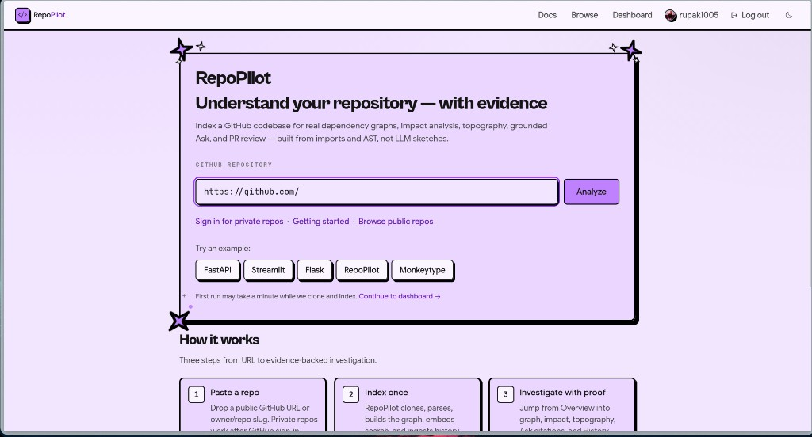
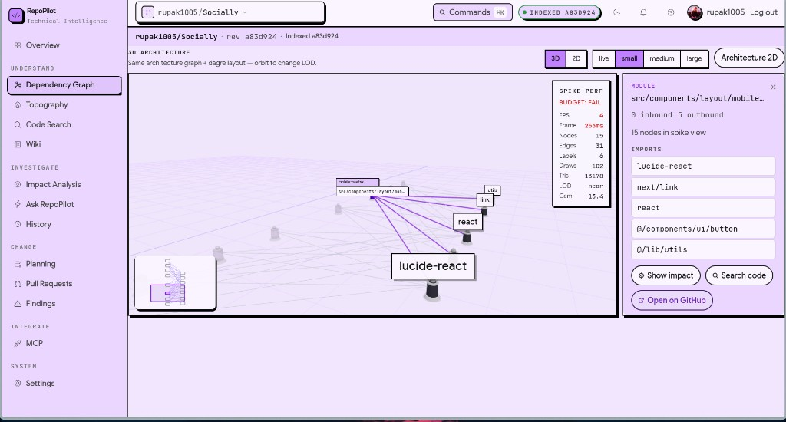
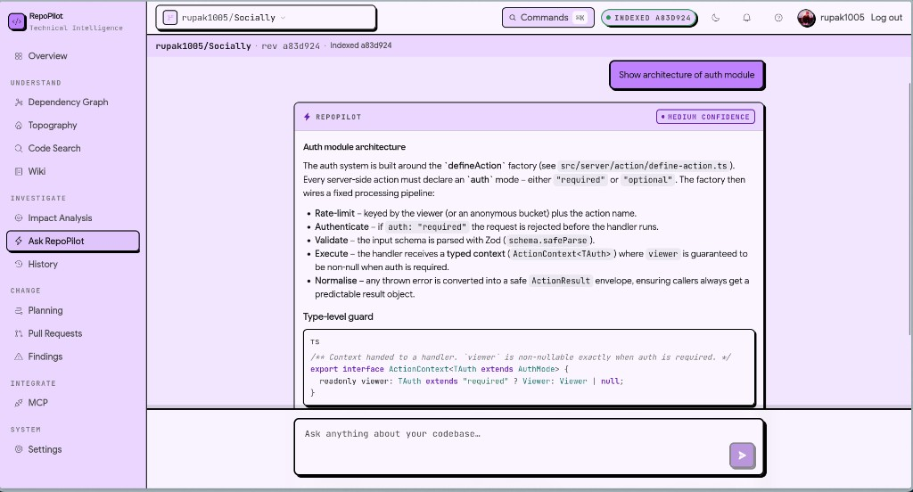
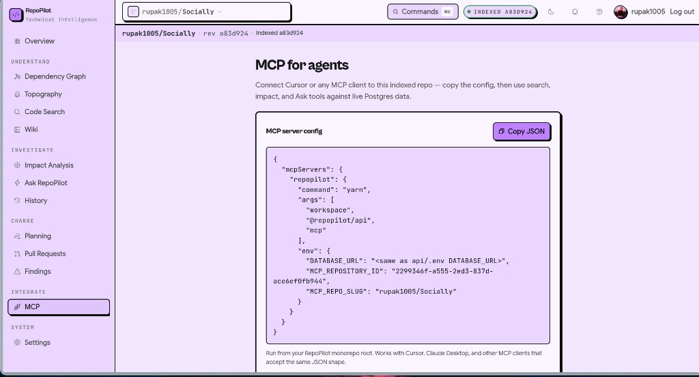

<p align="center">
  
</p>

<h1 align="center">RepoPilot</h1>

<p align="center">
  <strong>Technical intelligence for GitHub repositories</strong><br/>
  Real dependency graphs · Impact · Grounded Ask · MCP for agents<br/>
  <em>Built from AST and imports — not LLM sketches.</em>
</p>

<p align="center">
  <a href="https://repopilot.software"></a>
  <a href="https://repopilot-pi.vercel.app"></a>
  <a href="https://github.com/rupak1005/repopilot-app/actions"></a>
</p>

<p align="center">
  <a href="https://repopilot.software">Open the app</a> ·
  <a href="#unique-selling-points">USPs</a> ·
  <a href="#product-tour">Tour</a> ·
  <a href="#quick-start">Quick start</a> ·
  <a href="#documentation">Docs</a>
</p>

---

<p align="center">
  
</p>

<p align="center"><sub>Paste a public GitHub URL. Index once. Investigate with proof.</sub></p>

---

## Unique selling points

| USP | Why it matters |
|-----|----------------|
| **Evidence over vibes** | Graphs and answers come from Tree-sitter AST + real import edges — not a model inventing architecture. |
| **Cinematic system maps** | Interactive 2D and opt-in **3D topography** make structure tangible for reviews and onboarding. |
| **Grounded Ask** | Natural-language Q&A with citations to files and lines — confidence you can verify. |
| **Impact before you merge** | Blast-radius analysis for a file or change so you see what breaks before CI does. |
| **Agents that see your graph** | **MCP** exposes search, impact, Ask, and context to Cursor / Claude against live indexed data. |
| **Zero-friction guest path** | Analyze a public repo without signing in; OAuth unlocks private repos. |

---

## Product tour

### 1 · Landing — analyze in one step

Drop `owner/repo` or a GitHub URL. RepoPilot clones, parses, builds the graph, embeds search, and ingests history.

<p align="center">
  
</p>

### 2 · Architecture — 3D dependency graph

Orbit a live module map. Select a file → inbound/outbound deps, impact, search, and GitHub — same intelligence as the 2D graph, spatialized.

<p align="center">
  
</p>

### 3 · Ask RepoPilot — answers with citations

Ask “Show architecture of the auth module.” Get a structured answer, confidence, and code you can open — not a hallucinated tour.

<p align="center">
  
</p>

### 4 · MCP — wire the graph into your agent

Copy JSON config. Point Cursor or Claude Desktop at this indexed repo. Agents call the same search / impact / Ask tools your dashboard uses.

<p align="center">
  
</p>

---

## What you get in the workspace

| Area | Capabilities |
|------|----------------|
| **Understand** | Overview · Dependency Graph · Topography · Code Search · Wiki |
| **Investigate** | Impact Analysis · Ask RepoPilot · History / hotspots |
| **Change** | Planning · Pull Requests · Findings |
| **Integrate** | MCP for IDE agents |
| **System** | Settings · indexing status by revision SHA |

---

## How it works

```text
GitHub repo
    │
    ▼
 Clone → Parse (Tree-sitter) → Graph → Embeddings → History
    │
    ▼
 Postgres + pgvector · Redis
    │
    ├── Web dashboard  (Next.js)     https://repopilot.software
    ├── REST API       (Fastify)
    └── MCP server     (stdio tools for agents)
```

Languages with first-class AST edges today: **TypeScript, JavaScript, Python, Go**.

---

## Stack

| Layer | Tech |
|-------|------|
| App | Next.js, neo-brutalist design system |
| API | Fastify, Prisma, Tree-sitter |
| Data | Postgres + pgvector, Redis |
| AI | Configurable chat (e.g. Groq) + local embeddings by default |
| Agents | Model Context Protocol (MCP) |
| Deploy | Vercel (web) · Railway/Render (API) · Neon · Upstash |

Marketing site lives separately: [repopilot-pi.vercel.app](https://repopilot-pi.vercel.app/).

---

## Quick start

**Prerequisites:** Node 20+, Yarn 1.22, Postgres 15 + pgvector, Redis 7, Git.

```bash
docker compose up -d db redis

cp api/.env.example api/.env
cp web/.env.example web/.env.local

yarn install
yarn --cwd api prisma generate
yarn --cwd api prisma migrate deploy

yarn --cwd api dev    # http://localhost:3001
yarn --cwd web dev    # http://localhost:3000
```

| Env | Minimum |
|-----|---------|
| `api/.env` | `DATABASE_URL`, Redis, `PORT=3001`, `INDEX_INLINE=true` |
| `web/.env.local` | `NEXT_PUBLIC_API_URL=http://localhost:3001`, `SESSION_SECRET` |

Optional free Ask stack:

```env
LLM_PROVIDER=groq
GROQ_API_KEY=gsk_...
GROQ_CHAT_MODEL=openai/gpt-oss-120b
EMBEDDING_PROVIDER=local
```

Demo UI without indexing: `NEXT_PUBLIC_DEMO_MODE=true` in `web/.env.local`.

Full detail: [docs/SETUP.md](docs/SETUP.md) · [docs/AI_PROVIDERS.md](docs/AI_PROVIDERS.md) · [docs/FREE_DEPLOY.md](docs/FREE_DEPLOY.md)

---

## Monorepo layout

```text
web/       Next.js dashboard + BFF (OAuth, sessions)
api/       Fastify API, indexer, worker, MCP
common/    Shared helpers
docs/      PRD, HLD, LLD, deploy, showcase screenshots
e2e/       Playwright
scripts/   Index helpers
```

```bash
yarn ci    # lint → type-check → build → coverage → e2e
```

---

## Documentation

| Doc | Purpose |
|-----|---------|
| [docs/PRD.md](docs/PRD.md) | Product requirements |
| [docs/HLD.md](docs/HLD.md) | System design |
| [docs/LLD.md](docs/LLD.md) | Modules & APIs |
| [docs/SETUP.md](docs/SETUP.md) | Local development |
| [docs/PRODUCTION_DOMAIN.md](docs/PRODUCTION_DOMAIN.md) | Custom domain |
| [DESIGN.md](DESIGN.md) | Visual system |
| [docs/showcase/](docs/showcase/) | README screenshots |

In-app docs: `/docs` on the running app.

---

## Security

- HMAC session cookies (`SESSION_SECRET`)
- Optional `INTERNAL_API_SECRET` for BFF → API
- GitHub webhook signature verification
- Ask / review are **advisory** — grounded when context exists, not a hard CI gate

---

<p align="center">
  <strong>Understand the system. Prove the answer. Ship with context.</strong><br/>
  <a href="https://repopilot.software">repopilot.software</a>
  ·
  <a href="https://github.com/rupak1005/repopilot-app">GitHub</a>
</p>
