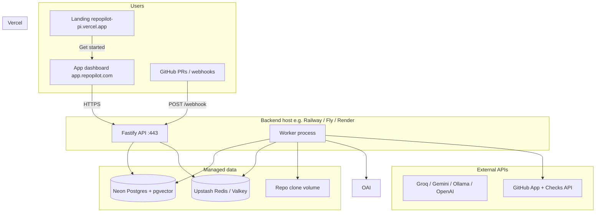

# RepoPilot — Roadmap to Production

**Status:** Living document  
**Audience:** Founders, engineers shipping RepoPilot  
**Starting point:** Phases 1–10 implemented locally; **marketing** at [repopilot-pi.vercel.app](https://repopilot-pi.vercel.app/) (separate repo/Vercel project, stays separate); **app dashboard** in this monorepo `web/`; API/worker on localhost until deployed.

### Locked decision: marketing stays separate

| Site | URL | Repo | Purpose |
|------|-----|------|---------|
| **Marketing** | [repopilot-pi.vercel.app](https://repopilot-pi.vercel.app/) | Separate Vercel project | Landing, positioning, CTAs |
| **App** | Deploy `web/` e.g. `app.repopilot.com` | This monorepo | Dashboard: search, Q&A, PRs |
| **API** | Deploy `api/` e.g. `api.repopilot.com` | This monorepo | Webhooks, worker, DB |

Marketing links **out** to the app URL. Do **not** merge landing into `web/`.

See also: [AI_PROVIDERS.md](./AI_PROVIDERS.md) for free Groq/Gemini/Ollama setup.  
**Free deploy walkthrough:** [FREE_DEPLOY.md](./FREE_DEPLOY.md)

This is **not** a repeat of [RepoPilot_Implementation_Roadmap.md](./RepoPilot_Implementation_Roadmap.md) (build features). This doc covers **everything left to ship a reliable, secure, demo-able product in production**.

---

## 1. Current state (baseline)

| Area | Status |
|------|--------|
| Backend Phases 1–10 | Implemented (`api/`, migrations, worker, CLI) |
| Local infra | Postgres + pgvector + Valkey/Redis working |
| Web dashboard | Search, Q&A, PRs, hotspots (`web/pages/index.tsx`) |
| Landing / marketing | **Separate** — [repopilot-pi.vercel.app](https://repopilot-pi.vercel.app/) (never merged) |
| GitHub | PAT + webhook secret in `.env`; **no GitHub App install flow** |
| Auth / tenants | **Not implemented** — APIs are open by repo UUID |
| AI | **Groq / Gemini / Ollama / local** supported — see [AI_PROVIDERS.md](./AI_PROVIDERS.md) |
| P0 infra | CORS env, `/health` DB+Redis, CI pgvector, docker pgvector image |
| Deploy | Dockerfiles + `docker-compose.yml` exist; **nothing deployed** |
| CI | GitHub Actions lint/type-check/test only — **no CD** |

**Rough completion:** ~90% engineering roadmap code, ~70% MVP story, ~40% production-ready product.

---

## 2. Production target

Align with PRD §44 release stages:

| Stage | Goal | Exit criteria |
|-------|------|----------------|
| **Alpha** | You can demo end-to-end on real GitHub repos | Public API URL, webhooks work, one repo fully indexed, PR → Check published |
| **Private beta** | Trusted users install without hand-holding | GitHub App, auth, monitoring, error budgets |
| **Public beta** | Multi-tenant SaaS | Billing, tenant isolation, security review |
| **GA** | Operated product | SLOs, runbooks, data deletion, cost controls |

**First milestone:** **Alpha** — everything in Phases P0–P3 below.

---

## 3. Target architecture (Alpha)



**Principle:** Vercel serves static/marketing + Next.js UI. **API + worker never on Vercel** (long-running jobs, webhooks, git clones need a container/VM).

---

## 4. Implementation phases

Each phase has **tasks**, **acceptance criteria**, and **depends on**. Order matters.

---

### P0 — Unblock production prerequisites (1–2 days)

**Objective:** Fix blockers that work locally but fail in prod.

| # | Task | Notes |
|---|------|-------|
| P0.1 | **OpenAI billing** | Add payment method; re-run `index-search` with real embeddings |
| P0.2 | **Secrets hygiene** | Confirm `api/.env`, `web/.env.local` gitignored; rotate any keys pasted in chat |
| P0.3 | **Docker pgvector** | Use `pgvector/pgvector:pg15` (or Neon with `CREATE EXTENSION vector`) — never manual `postgresql.auto.conf` hacks |
| P0.4 | **CI pgvector** | ✅ `pgvector/pgvector:pg15` + migrate in CI |
| P0.5 | **Health checks** | ✅ `/health` checks Postgres + Redis |
| P0.6 | **CORS** | ✅ `CORS_ORIGINS` env (set app URL, not marketing unless needed) |
| P0.7 | **Free AI providers** | ✅ Groq, Gemini, Ollama — [AI_PROVIDERS.md](./AI_PROVIDERS.md) |

**Acceptance:** `yarn test` green in CI with vector extension; OpenAI index-search succeeds once; no secrets in git.

---

### P1 — Deploy backend (Alpha infra) (2–4 days)

**Objective:** Public HTTPS API + worker + managed Postgres/Redis.

#### Recommended stack (minimal ops)

| Component | Suggestion | Why |
|-----------|------------|-----|
| Postgres | [Neon](https://neon.tech) | pgvector, branching, serverless-friendly |
| Redis | [Upstash](https://upstash.com) | Serverless Redis; no self-host |
| API + Worker | [Railway](https://railway.app) or [Fly.io](https://fly.io) | Docker deploy, persistent volume for `REPO_CLONE_ROOT` |
| Secrets | Platform env vars | Not committed files |

#### Tasks

| # | Task |
|---|------|
| P1.1 | Create Neon project → enable `vector` → set `DATABASE_URL` |
| P1.2 | Create Upstash Redis → set `REDIS_HOST`, `REDIS_PORT`, password if needed |
| P1.3 | Deploy **api** service from `api/Dockerfile`; expose port 443 |
| P1.4 | Deploy **worker** same image, `command: yarn --cwd api worker`; attach volume at `/data/repos` |
| P1.5 | Run `prisma migrate deploy` on deploy (release command or one-off job) |
| P1.6 | Set env: `DATABASE_URL`, `REDIS_*`, `PORT`, `REPO_CLONE_ROOT`, `OPENAI_API_KEY`, `GITHUB_TOKEN`, `GITHUB_WEBHOOK_SECRET` |
| P1.7 | Custom domain e.g. `api.repopilot.com` + TLS |
| P1.8 | Smoke test: `curl https://api.repopilot.com/health` |

**Acceptance:** API reachable on HTTPS; worker logs show job poll loop; migrations applied on Neon.

**Docker Compose (single VPS alternative):** Use `docker compose up -d` on a small VM with Caddy/nginx reverse proxy — faster but you operate Postgres backups yourself.

---

### P2 — Connect frontend to production API (1–2 days)

**Objective:** Landing and dashboard talk to deployed API, not localhost.

| # | Task |
|---|------|
| P2.1 | **URL scheme** | Marketing: `repopilot-pi.vercel.app` (fixed). App: `app.repopilot.com` or second Vercel project from `web/` |
| P2.2 | Deploy `web/` to Vercel (separate from marketing project) |
| P2.3 | Vercel env: `NEXT_PUBLIC_API_URL`, `NEXT_PUBLIC_MARKETING_URL=https://repopilot-pi.vercel.app` |
| P2.4 | Marketing CTA on repopilot-pi points to **app URL** (you edit marketing repo) |
| P2.5 | Dashboard search + Q&A UI | ✅ added to `web/pages/index.tsx` |
| P2.6 | ~~Merge landing into web~~ | **Cancelled** — keep marketing separate |

**Acceptance:** Browser loads dashboard from Vercel; network tab shows calls to production API; no CORS errors.

---

### P3 — GitHub end-to-end (Alpha demo) (3–5 days)

**Objective:** Real PR → webhook → review job → GitHub Check. PRD MVP items 7–10.

| # | Task | Current gap |
|---|------|-------------|
| P3.1 | **Webhook URL** | Point GitHub webhook to `https://api.repopilot.com/webhook` (not ngrok long-term) |
| P3.2 | **Webhook events** | Enable `push`, `pull_request` |
| P3.3 | **Repo clone on webhook** | Worker must `git clone` / fetch into `REPO_CLONE_ROOT` for installed repos (today: local path sync via CLI) |
| P3.4 | **GitHub App** (recommended) | Register app: Contents read, Pull requests read, Checks write, Webhooks |
| P3.5 | **Installation tokens** | Replace long-lived PAT with JWT → installation token in `githubCheckPublisher.ts` |
| P3.6 | **Install flow** | "Install GitHub App" button → callback stores `installationId` per repo |
| P3.7 | **Idempotency** | Already have `WebhookDelivery` — verify duplicate deliveries in prod logs |
| P3.8 | **Demo script** | Document: install app → open PR → see Check + dashboard update |

**Acceptance:** Open PR on connected repo → webhook 200 → worker completes → "RepoPilot Review" Check on commit within N minutes.

**Shortcut for Alpha:** Keep PAT + manual webhook on one repo; defer full GitHub App to P4 if time-constrained (document limitation).

---

### P4 — Auth & repository connection (Private beta) (1–2 weeks)

**Objective:** Users sign in; repos scoped to identity; no guessing UUIDs.

| # | Task |
|---|------|
| P4.1 | GitHub OAuth or GitHub App user-to-server for login |
| P4.2 | `User` table already exists — link GitHub login → `User.id` |
| P4.3 | `Repository` rows owned by user/installation; enforce on every API route |
| P4.4 | Replace paste-UUID UX with repo picker after install |
| P4.5 | API middleware: reject cross-tenant `repoId` access |
| P4.6 | Session/JWT or HTTP-only cookie via Next.js API routes |

**Acceptance:** User A cannot read User B's repo by UUID; unauthenticated requests return 401.

---

### P5 — Reliability & observability (1 week)

**Objective:** Know when prod is broken before users do.

| # | Task |
|---|------|
| P5.1 | Structured logs (Pino) → platform logs or Axiom/Datadog |
| P5.2 | Metrics: webhook latency, job queue depth, review duration, OpenAI errors |
| P5.3 | Alerts: worker stopped, migration failed, 5xx rate, queue backlog |
| P5.4 | Worker retries + dead-letter for failed `QueuedJob` rows |
| P5.5 | Rate limits on `/ask` and `/search` (per repo / per user) |
| P5.6 | Graceful degradation when OpenAI down (FTS-only search, cached answers) |
| P5.7 | DB backups (Neon automatic); document restore procedure |
| P5.8 | Upgrade worker from DB poll to BullMQ **only if** queue depth justifies it |

**Acceptance:** Simulated worker crash pages on-call; failed job visible in DB + logs; `/health` fails if DB unreachable.

---

### P6 — CI/CD & release process (2–3 days)

**Objective:** Push to main → tested → deployed.

| # | Task |
|---|------|
| P6.1 | GitHub Actions: build Docker images on tag |
| P6.2 | Push to GHCR or Railway/Fly registry |
| P6.3 | Deploy api + worker on merge to `main` (staging) and tag (prod) |
| P6.4 | Vercel: preview deploys on PR; production on `main` |
| P6.5 | Run `prisma migrate deploy` in deploy pipeline before traffic shift |
| P6.6 | Staging environment (separate Neon branch + staging API URL) |

**Acceptance:** One-click (merge) deploy with rollback; staging mirrors prod schema.

---

### P7 — Security & compliance (Private beta gate) (1 week)

PRD §Repository Security, §AI Security.

| # | Task |
|---|------|
| P7.1 | Threat model doc (webhook forgery, token leak, prompt injection) |
| P7.2 | Webhook signature verification — already implemented; add test in prod |
| P7.3 | Encrypt `GITHUB_TOKEN` / app private key at rest (KMS or platform secrets) |
| P7.4 | Repo data retention + deletion API (GDPR-style) |
| P7.5 | Audit log for admin actions |
| P7.6 | Dependency scanning (Dependabot already via GitHub) |
| P7.7 | Pen test or self-assessment before public beta |

**Acceptance:** Security checklist in PRD §43 signed off for private beta invite list.

---

### P8 — Public beta & GA (ongoing)

| # | Task |
|---|------|
| P8.1 | Multi-tenant billing (Stripe + usage limits on embeddings/reviews) |
| P8.2 | Org/workspace model |
| P8.3 | SLO targets (e.g. 99.5% API, P95 review < 10 min) |
| P8.4 | Public docs + status page |
| P8.5 | Cost caps on OpenAI (per-repo daily budget) |
| P8.6 | Language expansion beyond TS/JS (Python, Go parsers) |

---

## 5. Priority order (what to do next)

If you only have one week:

```text
Week 1 (Alpha)
├── P0  OpenAI billing + CI pgvector + CORS lockdown
├── P1  Deploy API + worker + Neon + Upstash
├── P2  Vercel dashboard → production API URL
└── P3  GitHub webhook on prod URL + one repo demo PR

Week 2–3 (Private beta prep)
├── P3  Full GitHub App (if skipped)
├── P4  Auth + tenant isolation
└── P5  Logging + alerts

Week 4+
├── P6  CD pipeline
├── P7  Security review
└── P8  Billing / GA
```

---

## 6. Environment matrix

| Variable | Alpha | Notes |
|----------|-------|-------|
| `DATABASE_URL` | Neon | Must have pgvector |
| `REDIS_HOST` / `REDIS_PORT` | Upstash | Or managed Valkey |
| `OPENAI_API_KEY` | Required | Billing enabled |
| `GITHUB_TOKEN` | PAT ok for Alpha | Replace with App token for beta |
| `GITHUB_WEBHOOK_SECRET` | Required | Same in GitHub webhook settings |
| `GITHUB_APP_ID` | Beta+ | Phase P3.4 |
| `GITHUB_PRIVATE_KEY` | Beta+ | PEM for JWT auth |
| `REPO_CLONE_ROOT` | `/data/repos` | Persistent volume on worker |
| `NEXT_PUBLIC_API_URL` | Vercel | Production API URL |

---

## 7. Alpha demo checklist (copy/paste)

Use this to verify "production Alpha" before inviting anyone:

- [ ] Landing [repopilot-pi.vercel.app](https://repopilot-pi.vercel.app/) links to live app
- [ ] `https://api.<domain>/health` returns ok with DB connected
- [ ] Repo indexed on production (CLI or post-install sync)
- [ ] Search returns results in dashboard
- [ ] Ask returns grounded answer (OpenAI quota ok)
- [ ] GitHub webhook deliveries show 200 in repo settings
- [ ] PR opened → review job queued → Check published
- [ ] Hotspots / analytics load for repo
- [ ] Secrets not in git; `.env` gitignored
- [ ] Worker restarts automatically on crash (platform policy)

---

## 8. Known gaps in codebase (track as issues)

| Gap | Phase | Effort |
|-----|-------|--------|
| No git clone from GitHub on webhook | P3 | M |
| No GitHub App JWT auth | P3 | M |
| No user auth / API authorization | P4 | L |
| Dashboard missing search + Q&A UI | P2 | ✅ Done |
| CORS wide open (`origin: true`) | P0 | ✅ `CORS_ORIGINS` |
| CI missing pgvector migration test | P0 | ✅ Done |
| Landing separate from monorepo | P2 | ✅ By design |
| Worker uses DB poll not BullMQ | P5 | S (defer) |
| OpenAI-only; no fallback provider config | P5 | M |

---

## 9. Cost rough estimate (Alpha)

| Service | Monthly (low traffic) |
|---------|------------------------|
| Neon free tier | $0–19 |
| Upstash free tier | $0–10 |
| Railway/Fly (api + worker) | $5–20 |
| Vercel hobby | $0 |
| OpenAI (embeddings + reviews) | Variable — set budget caps |
| **Total infra** | **~$10–50/mo** excluding OpenAI usage |

---

## 10. Related docs

- [RepoPilot_PRD.md](./RepoPilot_PRD.md) — MVP definition (§38), release strategy (§44)
- [RepoPilot_Implementation_Roadmap.md](./RepoPilot_Implementation_Roadmap.md) — feature phases 1–10 (done)
- [SETUP.md](./SETUP.md) — local dev
- [docker-compose.yml](../docker-compose.yml) — full stack local / VPS

---

## 11. Decision log (fill as you go)

| Date | Decision | Rationale |
|------|----------|-----------|
| 2026-08-19 | Marketing stays at repopilot-pi.vercel.app (separate) | App dashboard deploys from monorepo `web/` only |
| 2026-08-19 | Free AI: Groq/Gemini chat + local/Ollama embeddings | OpenAI quota blocked; see AI_PROVIDERS.md |
| | Backend host: Railway vs Fly vs VPS | |
| | Alpha: PAT vs GitHub App | |

---

*Update this doc when a phase completes. Target: Alpha within 1–2 weeks of focused work.*
