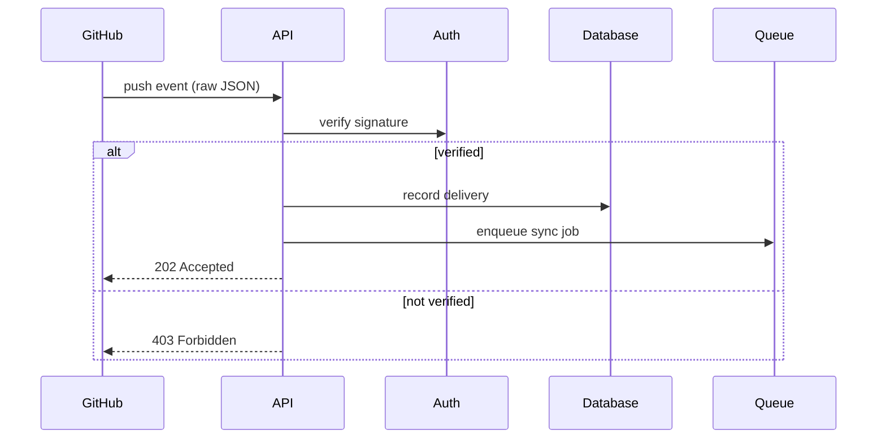
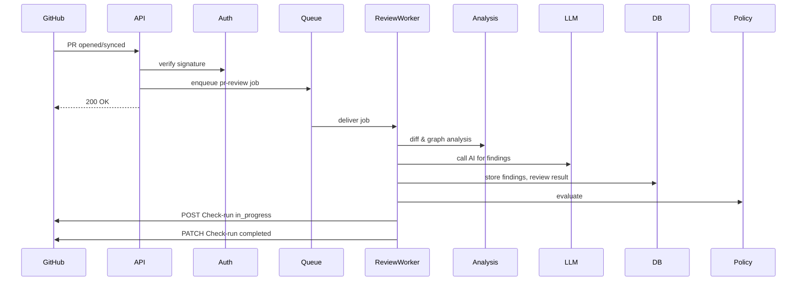

# Implementation Plan and Design for RepoPilot

**Table of Contents**

- [MASTER_PROMPTS.md – Consolidated Phase Prompts and Tasks](#master_prompts)
- [HLD.md – High-Level Design](#hld)
- [LLD/phase-01.md – Phase 1 Detailed Tasks](#lld-phase-01)
- [LLD/phase-02.md – Phase 2 Detailed Tasks](#lld-phase-02)
- [LLD/phase-03.md – Phase 3 Detailed Tasks](#lld-phase-03)
- [LLD/phase-04.md – Phase 4 Detailed Tasks](#lld-phase-04)
- [LLD/phase-05.md – Phase 5 Detailed Tasks](#lld-phase-05)
- [LLD/phase-06.md – Phase 6 Detailed Tasks](#lld-phase-06)
- [LLD/phase-07.md – Phase 7 Detailed Tasks](#lld-phase-07)
- [LLD/phase-08.md – Phase 8 Detailed Tasks](#lld-phase-08)
- [LLD/phase-09.md – Phase 9 Detailed Tasks](#lld-phase-09)
- [LLD/phase-10.md – Phase 10 Detailed Tasks](#lld-phase-10)

## Executive Summary

This implementation pack details the full design and development plan for **RepoPilot**, an AI-driven engineering intelligence platform. It consolidates all requirements, architecture, and step-by-step tasks across Phases 1–10, from initial code analysis up through advanced historical and architectural insights. The goals are to deliver a robust, secure, and scalable system with clear developer workflows. 

Key deliverables include:

- **MASTER_PROMPTS.md**: Combined Phase 1–10 objectives expanded into implementable tasks, including APIs, data models, security, and acceptance criteria.
- **HLD.md**: Overall system architecture, component responsibilities, data flows, integration points (GitHub, LLM, databases), scaling, failure modes, observability, and security design.
- **LLD/phase-XX.md** (10 files): Phase-by-phase detailed design with code interface sketches, DB schemas, API routes, worker job specs, test plans, and security hardening measures. 

The recommended next steps are to implement Phase 1 (foundation and code parsing) first, then iterate phase by phase, verifying functionality at each milestone. The minimal viable product (MVP) covers Phases 1–7 (basic code analysis, graph, persistence, search, and GitHub integration) to enable a working prototype with repository sync and search. Subsequent phases add PR review (Phase 8), CI automation (Phase 9), and historical intelligence (Phase 10). A thorough validation plan includes unit/integration tests, GitHub mocking, LLM response testing, and end-to-end scenarios (e.g., connecting a repo, syncing code, asking queries, and PRs).

---

<a name="master_prompts"></a>
# MASTER_PROMPTS.md  
*Consolidated Phase 1–10 Prompts with Detailed Tasks*

## Overview

This master document compiles all Phase 1–10 objectives and breakouts into actionable tasks. Each phase section includes:

- **Objective:** high-level goal for the phase.
- **Scope:** what to implement and what to exclude.
- **Architecture Principles:** guidelines to follow.
- **Domain Models:** key entities/interfaces.
- **APIs & Endpoints:** essential API design.
- **Database Schema (suggestions):** core tables/fields.
- **Job/Queue Design:** background processes.
- **Security Checklist:** items to enforce.
- **Testing Requirements:** unit/integration test outline.
- **ADRs:** recommended design decisions.
- **Acceptance Criteria:** endpoints/tests that define success.
- **Task List:** prioritized steps with T-shirt effort estimates and dependencies.

At the end is a summary table of phases vs deliverables.

---

## Phase 1 – Foundation  
- **Objective:** Establish core infrastructure (monorepo, CI, logging, env, PostgreSQL, Redis, Docker).  
- **Implement:** Project scaffolding (TS, Next.js, Fastify, Docker, CI config, logging, retryable tasks).  
- **Exclude:** Repository-specific logic, AI functions, Git integration.  
- **Principles:** *Modularity*, *Configuration-as-Code*, *Maintainability*.  
- **Domain Models:** `Config`, `Environment`, `Logger`, `JobQueue`, `DatabaseConnection`.  
- **APIs:** Health endpoints (`/health`, `/ready`), basic GET root.  
- **DB Schema:** Tables: `users`, `accounts` for future use, `jobs`, `logs`.  
- **Jobs:** Setup Redis-backed queue stub.  
- **Security:** Input validation, secure config (no secrets in code), least privilege for DB user, structured logging (no secrets).  
- **Tests:** Unit tests for config, logger, health routes.  
- **ADRs:** Use Fastify for APIs (performance), dotenv or vault for secrets, structure monorepo with packages.  
- **Acceptance:** CI builds, lint passes, health endpoints return OK, DB migration runs.  
- **Tasks:**  
  1. **Project setup** (S): Create TS monorepo, configure Fastify server, Dockerfile, Redis, Postgres services.  
  2. **Config & Secrets** (S): Environment and config management, ensure secrets encrypted-at-rest or via env.  
  3. **Logging** (S): Structured JSON logging library.  
  4. **DB Setup** (S): Init Postgres connection, basic migrations, `users`, `accounts` tables.  
  5. **Redis Setup** (M): Connect Redis, basic queue package.  
  6. **Health Endpoints** (S): `/health` and `/ready` that check dependencies.  
  7. **CI/CD** (M): Lint, typecheck, test, build pipelines.  
  8. **Error Handling** (M): Global error handler,  unhandled rejection logging.  
  9. **Security Review** (S): Validate no secrets logged, basic input sanitization.  

---

## Phase 2 – Repository Analyzer  
- **Objective:** Scan repositories, parse code with Tree-sitter, gather symbols, imports/exports, ignoring `.gitignore`.  
- **Implement:** Local FS scanning service, Tree-sitter parsing for JS/TS (and future languages), symbol tables, ASTs.  
- **Exclude:** Git or provider dependency; should work on any local repo snapshot.  
- **Principle:** *Language-agnostic parsing*, *caching*, *modular parser per language*.  
- **Domain Models:** `File`, `Symbol`, `Language`, `ParseResult`.  
- **APIs:** Internal service `analyzeRepository(repoPath) -> AnalysisResult`.  
- **DB:** Tables: `analysis_runs`, `files`, `symbols` (fields: repoId, path, type, name, loc, etc).  
- **Jobs:** Analysis run queue if heavy.  
- **Security:** Limit file size and count, avoid executing code, treat code as untrusted.  
- **Tests:** Unit parse tests (e.g. parse a function, ensure symbols extracted).  
- **ADRs:** Use Tree-sitter (支持增量 parsing, multi-language), do not run user scripts during analysis.  
- **Acceptance:** Successfully parse sample JS/TS repo and store symbols.  
- **Tasks:**  
  1. **Workspace Abstraction** (S): Create a safe temp directory mechanism (auto-cleanup).  
  2. **Git Source Adapter** (M): (Local for now) Checkout or copy repo to workspace.  
  3. **File Scanning** (S): Walk repo, respect `.gitignore`, file size limits.  
  4. **Tree-sitter Setup** (M): Install and configure TS grammar.  
  5. **Parse Service** (M): Interface to parse files, extract symbol metadata.  
  6. **Symbol DB** (M): Store parsed symbols, references, locs.  
  7. **Content Indexing** (M): Chunk code (per function/block) for search; store in DB.  
  8. **Error Handling** (S): skip unparseable files with warnings.  
  9. **Testing** (M): Parser test cases (small functions, classes).  

---

## Phase 3 – Dependency Graph  
- **Objective:** Build a graph of modules/files/symbols and their import/call relationships.  
- **Implement:** Graph builder linking files/symbols via imports and references.  
- **Exclude:** UI concerns; focus on data structures.  
- **Principle:** *Immutable analysis runs*, *efficient traversal*, *cache adjacency*.  
- **Domain Models:** Graph nodes (`Module`, `Function`), edges (`imports`, `calls`).  
- **APIs:** Graph queries: find dependents, callers, cycle detection.  
- **DB:** Graph tables: `dependencies`, `calls`, `module_imports`.  
- **Jobs:** Graph build after analysis run.  
- **Security:** Graph data from trust; no exec.  
- **Tests:** Cycle detection unit test, known small dependency graph.  
- **ADRs:** Use adjacency lists in DB; precompute full graph for speed.  
- **Acceptance:** Able to retrieve dependency tree for a symbol.  
- **Tasks:**  
  1. **Graph Schema** (S): Define tables `nodes`, `edges` with types.  
  2. **Edge Extraction** (M): After parse, analyze AST imports & calls.  
  3. **Graph Storage** (M): Insert edges (type, source, target).  
  4. **Graph Services** (M): `getDependents(symbol)`, `getCallers(symbol)`, etc.  
  5. **Cycle Detection** (M): Detect cycles (e.g. Tarjan's algorithm).  
  6. **Impact Analysis Service** (L): Given changes, compute closure of affected nodes.  
  7. **Testing** (S/M): Graph tests (acyclic small graphs).  
  8. **Documentation** (S): Document graph model.  

---

## Phase 4 – Persistence & Versioning  
- **Objective:** Store repository meta (repo, revisions, analysis runs) immutably and support versions.  
- **Implement:** DB schema for repos, revisions, runs, graph versions; ensure atomic updates.  
- **Exclude:** Branching UI.  
- **Principle:** *Immutability*, *transactional integrity*, *version history*.  
- **Models:** `Repository`, `Revision`, `AnalysisRun`, `GraphVersion`.  
- **APIs:** 
  - `POST /repositories` 
  - `POST /repositories/:id/sync` 
  - `GET /repositories/:id/revisions`
- **DB:** Tables: `repositories`, `revisions`, `analysis_runs`, `graphs`.  
- **Jobs:** Sync orchestration job.  
- **Security:** Repo identity by provider+ID (not name).  
- **Tests:** Historical queries, ensure old graph intact.  
- **ADRs:** Use SHA for revision identity; treat branch pointer separate.  
- **Acceptance:** Can list all revisions and associated graphs; cannot overwrite active without success.  
- **Tasks:**  
  1. **DB Models** (S): Create `repositories(id, provider, external_id, name, default_branch, status)`; `revisions(id, repo_id, sha, created_at)`; `analysis_runs(id, repo_id, revision_id, status)`.  
  2. **Transaction Logic** (M): Atomic update of active revision vs new revision.  
  3. **Graph Versioning** (M): Tag graph builds with revision.  
  4. **Revision Service** (S): Resolve branch to SHA via Git provider (do not analyze HEAD).  
  5. **Sync Service** (M): Orchestrate fetch, analyze, build graph, commit.  
  6. **Migration** (S): Ensure reversible migrations.  
  7. **Locking Mechanism** (M): Use Redis lock to prevent concurrent sync for same repo.  
  8. **Tests** (M): Attempt duplicate revision sync, ensure idempotency.  
  9. **Failure Recovery** (M): If sync fails, original graph remains active.  

---

## Phase 5 – Search & Retrieval  
- **Objective:** Provide code search by text and semantic (embedding) plus hybrid.  
- **Implement:** Chunking service, store text and embeddings (pgvector).  
- **Exclude:** NB: Only code (no natural language documents).  
- **Principle:** *Combine classical and vector search*, *index per revision*.  
- **Models:** `CodeChunk`, `Embedding`.  
- **APIs:** 
  - `GET /repositories/:id/search?query=text` 
  - `POST /repositories/:id/search/semantic`
- **DB:** Tables: `code_chunks(id, repo_id, revision_id, file_path, content, tokens)`; `embeddings(id, chunk_id, vector)`.  
- **Jobs:** Embedding generation queue for chunks.  
- **Security:** Do not expose raw code via API directly (only through chunk IDs).  
- **Tests:** Search returns relevant results (e.g. known code snippets).  
- **ADRs:** Use pgvector for embedding search; combine with full-text.  
- **Acceptance:** Lexical and semantic queries return code snippets with evidence.  
- **Tasks:**  
  1. **Chunking** (M): Split files into manageable chunks (e.g. by function), limit length.  
  2. **Vector Embedding** (L): Use LLM API or local model to embed code chunks, store in pgvector.  
  3. **Search Endpoints** (M): Lexical (SQL LIKE or full-text) and semantic (vector) queries.  
  4. **Reranking** (L): Combine hybrid results if needed.  
  5. **Retrieval Service** (M): Provide top-N relevant code snippets with scores.  
  6. **Testing** (M): Search unit tests with known keywords.  
  7. **Resource Limits** (S): Enforce token limits and query timeouts.  

---

## Phase 6 – AI Codebase Intelligence  
- **Objective:** Natural-language Q&A over codebase with evidence citations.  
- **Implement:** LLM integration, prompt templates, context builder, tool interfaces (e.g. code search, graph queries).  
- **Exclude:** Code generation/patching.  
- **Principle:** *Grounded answers*, *structured output*, *prompt injection defense*.  
- **Models:** `Question`, `Answer`, `Citation`.  
- **APIs:** 
  - `POST /qa` (with `question`, `context` params) 
  - `POST /chat` (for future conversation mode)
- **DB:** Log LLM queries/responses (for auditing).  
- **Jobs:** Synchronous LLM calls; use async if long context.  
- **Security:** Filter secrets from context, block sensitive content.  
- **Tests:** Given a question, ensure evidence IDs appear in answer.  
- **ADRs:** Use model-agnostic abstraction; restrict length; use Chain-of-Thought for reasoning.  
- **Acceptance:** Answers cite actual files/symbols (e.g. “File X, lines 10-15” from `Answer`).  
- **Tasks:**  
  1. **LLM Integration** (M): Abstract provider (OpenAI, Gemini) with rate-limit/backoff.  
  2. **Context Builder** (L): Gather relevant code chunks, docs, graph summaries, with weight priority.  
  3. **Prompt Templates** (M): System instructions to emphasize evidence-based answers.  
  4. **Structured Output Schema** (M): JSON schema for answer with fields (summary, citations, confidence).  
  5. **Tool Functions** (L): e.g. `search_code`, `get_dependencies`, exposed to model via prompt.  
  6. **Post-Processing** (M): Validate model output against schema (like evidence IDs).  
  7. **Test Cases** (L): Hallucination tests (e.g. ensure model says “unknown” if answer not in code).  
  8. **Security** (M): Exclude secrets (e.g. via regex filtering before sending).  
  9. **Evaluation** (M): Compare answers vs ground-truth on sample queries.  

---

## Phase 7 – GitHub Integration  
- **Objective:** Connect real GitHub repos via GitHub App, sync code and respond to webhooks.  
- **Implement:** GitHub App (installation flow), repo discovery, branch selection, OAuth states, webhook handlers, sync orchestration.  
- **Exclude:** Issues, PR code fix automation, multi-org RBAC.  
- **Principle:** *Provider-agnostic source*, *least privilege*, *atomic sync*.  
- **Models:** `RepositoryConnection`, `Branch`, `Installation`.  
- **APIs:** 
  - `GET /github/install` (redirect to app install)  
  - `POST /api/v1/webhooks/github` (raw body)  
- **DB:** Tables: `connections`, `sync_runs`, `webhook_deliveries`.  
- **Jobs:** Sync queue for new revisions.  
- **Security:** Encrypt GitHub tokens, verify webhook signature (HMAC SHA256).  
- **Tests:** Mock GitHub events (push, ping), ensure only selected branch triggers.  
- **ADRs:** Use GitHub App for per-repo scope; distinguish external IDs from names; caching branch list.  
- **Acceptance:** A connected repo appears “Ready” after initial sync; GitHub pushes cause sync.  
- **Tasks:**  
  1. **GitHub App Setup** (M): Create app, define permissions (Repo contents: read, webhooks; Metadata: read; Omit unnecessary scopes).  
  2. **OAuth Flow** (M): Secure `state` parameter, callback to obtain installation token (encrypted).  
  3. **Repo Picker UI/Endpoint** (M): List user’s accessible repos via GitHub API, filter by installation.  
  4. **Branch Selection** (S): Endpoint to list branches via GitHub API, default to `default_branch`.  
  5. **Connection DB** (S): Store `provider`, `installation_id`, `external_repo_id`, `owner`, `name`, `selected_branch`, `status`.  
  6. **Initial Sync** (L): On connect, queue sync job (resolve default branch SHA and analyze).  
  7. **Webhook Handler** (M): Receive `push` events, validate signature, deduplicate by delivery ID, enqueue sync if branch matches.  
  8. **Webhook Security** (M): Use `X-Hub-Signature-256` with constant-time compare; reject replay.  
  9. **Sync Job** (M): Detect new SHA, full rebuild of analysis & index; lock per repo to prevent concurrent.  
  10. **State Machine** (S): Track `SYNC_REQUESTED`, `FETCHING`, `ANALYZING`, `INDEXING`, `READY`, `FAILED` with timestamps.  
  11. **Error Handling** (S): If sync fails, mark failed and keep old graph active; alert/log.  
  12. **Testing** (M): Webhook E2E (initial sync, then push events); signature invalid cases.  

---

## Phase 8 – PR Intelligence & Review  
- **Objective:** Ingest PRs, analyze diffs with code intelligence, and produce structured AI review findings.  
- **Implement:** PR entity, diff parsing, symbol diff, graph diff, test impact, risk scoring, AI review with findings validation.  
- **Exclude:** Auto fixes, publishing comments.  
- **Principles:** *Base vs Head immutable*, *structured findings with evidence*, *precision over recall*.  
- **Models:** `PullRequest`, `PullRequestFile`, `PullRequestChange`, `PullRequestReview`, `ReviewFinding`, `ReviewEvidence`.  
- **APIs:** 
  - `GET /repositories/:id/pulls` 
  - `GET /repositories/:id/pulls/:number` 
  - `POST /repositories/:id/pulls/:number/review`
- **DB:** Tables: `pull_requests`, `pr_files`, `pr_changes`, `pr_reviews`, `review_findings`, `review_evidence`.  
- **Jobs:** PR review queue for new/updated PRs.  
- **Security:** Validate webhook, treat diff code as untrusted in prompts, protect LLM output.  
- **Tests:** PR diff parsing, symbol diff, impact mapping, mock LLM output compliance.  
- **ADRs:** Use immutable base/head SHAs, structured JSON output schema, findings require evidence.  
- **Acceptance:** Completed review with severity and confidence separated, correct evidence citations.  
- **Tasks:**  
  1. **PR Data Model** (S): `pull_requests` (repo_id, number, base_sha, head_sha, status, review_status).  
  2. **PR Diff Retrieval** (M): GitHub API or local git diff to list file changes with hunks.  
  3. **Diff Models** (M): `FileChange` with hunks, lines added/removed.  
  4. **Symbol Diff** (L): Compare symbols in base vs head graphs; categorize added/removed/changed.  
  5. **Dependency Impact** (L): For changed symbols, find callers/dependents via graph.  
  6. **Test Impact** (M): Identify test files that import or call changed symbols (e.g., using symbol graph).  
  7. **Risk Scoring** (L): Based on number of changes, API changes, dependents, historical signals.  
  8. **Review Context Builder** (M): Assemble changed code snippets, callers, interfaces, tests for LLM.  
  9. **Review Prompt** (M): System instructions emphasizing evidence, high-signal.  
  10. **LLM Review** (L): Call LLM with structured prompt for review findings.  
  11. **Findings Validation** (S): Ensure each finding has valid severity/category/confidence and citations.  
  12. **Deduplication** (S): Combine overlapping findings (e.g. same code location).  
  13. **Stale Handling** (S): Mark prior review as `STALE` on `synchronize`.  
  14. **Review API** (M): Endpoint to trigger or fetch latest review.  
  15. **Testing** (L): PR scenarios (no issues, missing test, API change). Prompt-injection tests: e.g., malicous code comments should not override prompt.  

---

## Phase 9 – CI & Workflow Integration  
- **Objective:** Automate PR reviews as part of CI: queues, workers, GitHub Checks, policy-based statuses, dashboards.  
- **Implement:** Background review jobs, GitHub Checks publishing (via GitHub API), review policy engine, review dashboards, usage metrics.  
- **Exclude:** Slack/Teams integration, enterprise SSO.  
- **Principles:** *Non-blocking defaults*, *idempotent publishing*, *security & quotas*.  
- **Models:** `ReviewJob`, `CheckRun`, `ReviewPolicy`, `ReviewFeedback`.  
- **APIs:** 
  - GitHub Check Runs API (via Octokit or direct REST)  
  - Internal review retrieval APIs (e.g. `GET /repositories/:id/reviews`)  
- **DB:** Extend `pull_request_reviews` with policy outcome, store GitHub Check IDs; `review_feedback` table for user flags.  
- **Jobs:** `pr-review` queue, `github-check` queue.  
- **Security:** Enforce repo ownership on all APIs; rate-limit user actions.  
- **Tests:** Simulate multiple concurrent PR updates, Check API failures.  
- **ADRs:** Checks for status/reporting; separate severity vs confidence in policy; use Redis or DB to track in-progress/pending jobs.  
- **Acceptance:** GitHub shows ✅/⚠/❌ per policy; stale reviews not shown as current.  
- **Tasks:**  
  1. **Worker Infrastructure** (S): Dedicated `review-worker` process; connect to Redis queue.  
  2. **Review Job Management** (M): `ReviewJob` record (repoId, prNumber, baseSha, headSha, attempts, status).  
  3. **Queue Configuration** (S): Separate Redis queues (`repo-sync`, `pr-review`).  
  4. **Concurrency** (M): Limit parallelism, allow override.  
  5. **Retry Policy** (M): Exponential backoff for transient errors, count attempts.  
  6. **Dead-Letter** (M): After N fails, mark job dead-letter; notify user to retry manually.  
  7. **Policy Engine** (L): Configurable rules per repo (fail_on severity, min_confidence). Use YAML config file (e.g. `.repopilot.yml`).  
  8. **GitHub Check Publisher** (M): Abstraction to `POST /repos/:owner/:repo/check-runs` and update run (`PATCH`).  
  9. **Annotations** (M): Add file/line annotations for findings via Checks API (comment format).  
  10. **Idempotency** (M): Record CheckRun IDs to update existing instead of new.  
  11. **Review Feedback UI** (M): Allow marking findings Useful/NotUseful via dashboard.  
  12. **Metrics & Logging** (S): Track job counts, durations, errors, LLM token usage.  
  13. **Testing** (L): E2E: Open PR triggers check, new commits triggers new check. Simulate GH API error, ensure retry/incomplete path.  

---

## Phase 10 – Advanced Engineering Intelligence  
- **Objective:** Ingest git history and PR history to build an engineering knowledge graph, detect hotspots, co-change patterns, architecture insights, and answer high-level questions.  
- **Implement:** Git history provider, commit model, co-change analysis, change frequency, module hotpot detection, historical graph queries, similarity search for PRs, architecture dashboard.  
- **Exclude:** Predictive ML beyond simple signals (no autoprediction of incidents).  
- **Principles:** *Data from source truth*, *explainability*, *reuse prior analysis*.  
- **Models:** `Commit`, `Author`, `ModuleHistory`, `CoChangeEdge`, `Hotspot`.  
- **APIs:** 
  - `GET /history/commits` 
  - `GET /modules/:id/hotspots` 
  - `GET /change-impact/advanced`
- **DB:** Tables: `commits`, `commit_changes`, `file_history`, `co_change`, `hotspots`.  
- **Jobs:** `history-ingest` queue to incrementally load commits, compute metrics.  
- **Security:** Owner checks on history, do not expose contributors outside context.  
- **Tests:** Simulated repository with known change patterns.  
- **ADRs:** Use multi-tenant data separation; genealogical queries via timestamp or revision.  
- **Acceptance:** Hotspot list with rationale, historical Q&A returns factual evidence.  
- **Tasks:**  
  1. **History Provider** (M): Git CLI or API to fetch commit list and diffs (`git log`, `git blame`).  
  2. **Commit Table** (S): Store commit metadata (sha, author, date).  
  3. **Co-Change Analysis** (L): From commit diffs, increment co-change counters between modules/files.  
  4. **Change Frequency** (S): Track changes per file/module/time; define sliding window metrics.  
  5. **Hotspot Computation** (L): Combine frequency, fan-out (graph edges), recurring issues to score modules.  
  6. **Knowledge Graph** (L): Integrate commit, PR, finding relationships. (e.g., `Authored`, `Changed`, `Reviewed`).  
  7. **Historical Search** (M): Extend retrieval to include commit messages, PR titles.  
  8. **LLM Prompts for History** (M): Templates to answer “Why did X change?” and "Similar changes?"  
  9. **Dashboard Components** (M): UI for architecture explorer showing dependencies, cycles, hotspots.  
  10. **Metric Tracking** (S): Timespan of ingest, number of entries, query latency.  
  11. **Testing** (L): Compare hotpots results to expected (e.g., “FileA changed 20 times vs FileB 2 times”).  

---

## Phases vs Deliverables & Effort

| Phase | Key Deliverables                      | T-shirt Effort |
|-------|----------------------------------------|----------------|
| 1     | Project scaffolding, CI, DB setup, Docker | S              |
| 2     | File parsing, AST, symbols DB, index    | M              |
| 3     | Dependency graph, cycle detection       | M              |
| 4     | Repo/revision schema, sync logic        | M              |
| 5     | Code search, embeddings (pgvector)      | L              |
| 6     | LLM abstraction, Q&A endpoint, context  | L              |
| 7     | GitHub App integration, webhooks, sync  | L              |
| 8     | PR diff analysis, symbol diff, AI review| L              |
| 9     | Review queue, GitHub Checks, policy     | L              |
| 10    | Git history ingest, hotspots, dashboard | L              |

*Totals:* Phases 1–4 (small/med), 5–10 (large).

Sources: GitHub Checks API, GitHub webhook validation, Redis locks, general best practices from official docs. 

---

<a name="hld"></a>
# HLD.md  
*High-Level Architecture and Design*

## Overview

RepoPilot is a multi-component system integrating code analysis, AI reasoning, and workflow automation. The high-level architecture is as follows:

```mermaid
graph LR
  subgraph "GitHub / Dev Workflow"
    A[GitHub Push/PR] -->|Webhook| B[API Server]
  end
  subgraph "API & Services"
    B -->|Routes + Auth| C(Repository Service)
    B --> D(PR Service)
    B --> E(Dev Dashboard)
    C --> F(Queue: sync)
    D --> G(Queue: pr-review)
    F --> H(Sync Workers)
    G --> I(Review Workers)
    H --> J(Analyzer + Graph Builder)
    H --> K(Indexer (Search))
    I --> L(Review Engine (LLM & AI))
    J --> K
    I --> M(ReviewPublisher)
    J --> N(Database)
    K --> N
    L --> N
    M --> O[GitHub Checks API]
  end
```

- **API Server (Fastify/Next.js)**: Handles GitHub callbacks, webhooks, user actions, and routes requests to services.
- **Repository Service**: Manages repo connections, invokes sync jobs.
- **PR Service**: Manages PR metadata and review jobs.
- **Queues (Redis)**: `sync` queue for repository syncs; `pr-review` queue for PR reviews.
- **Sync Worker**: Fetches code, runs analysis (Phase 2–4), builds graph (Phase 3), indexes code (Phase 5).
- **Review Worker**: Processes PR diffs, calls AI engine for Phase 8.
- **AI/Review Engine**: Uses retrieval and LLM to generate structured findings.
- **Databases**: PostgreSQL with pgvector extension for embeddings.
- **Caches/Services**: Redis for locks, queues; GitHub App for integration.

## Components and Responsibilities

- **Frontend/Dashboard**: Next.js UI for developers; visualizes repos, reviews, metrics.
- **API Layer (Fastify)**: Lightweight REST endpoints, auth (JWT or session), request validation.
- **Repository Connector**: Handles OAuth/GitHub App auth, lists repos, triggers initial sync.
- **Sync Service**: Orchestrates fetch → analyze → graph → index pipeline. Ensures atomic swap of active versions.
- **Analyzer (Phase 2)**: Uses Tree-sitter to parse code into symbols and indices for search.
- **Graph Builder (Phase 3)**: Builds dependency and symbol graphs.
- **Search/Indexer (Phase 5)**: Splits code into chunks, creates embeddings (pgvector) and text indexes.
- **AI Assistant (Phases 6,8,10)**: Coordinates retrieval and LLM queries for code questions and PR reviews.
- **PR Intelligence (Phase 8)**: Diffs base/head, computes impact, runs LLM review.
- **Worker Queue System**: Redis-backed, ensures idempotent job processing, with retries and TTL locks.
- **GitHub Integration**: Webhook receivers validate signatures; GitHub Checks API for PR status updates.
- **Security Services**: Token encryption, webhook signature validator.

## Data Flows

- **Initial Sync Flow**:
  1. User connects repo via GitHub App → server stores connection.
  2. Sync Job: fetches repo (e.g., via `git clone` or archive), resolves branch to SHA.
  3. Phase 2 Analyzer runs on workspace; updates `files/symbols`.
  4. Phase 3 Graph built.
  5. Phase 4 DB stores revision, graph version.
  6. Phase 5 Indexer embeds code.
  7. Mark repository READY.

- **Push Webhook Flow**:
  1. GitHub POSTs to `/webhooks/github`.
  2. Validate signature with HMAC SHA256.
  3. Parse JSON: if `ref` matches selected branch, enqueue sync.
  4. Return HTTP 2xx immediately; actual work is background.



- **PR Review Flow**:
  1. GitHub sends `pull_request` event.
  2. API verifies and marks old review stale.
  3. Enqueue PR review job.
  4. Worker loads base & head data, diffs.
  5. Impact analysis + retrieval context built.
  6. AI model generates findings.
  7. Findings validated and stored.
  8. Determine policy outcome, publish GitHub Check (queued→in_progress→completed).



## Integration Points

- **GitHub APIs:** Installation/permissions, webhooks, repository clone/download, branch listing, PR details, Checks API.
- **LLM Providers:** Abstract via `LLMClient` (OpenAI, Gemini); ensure retry/backoff on 429/5xx.
- **Database & pgvector:** Hybrid search queries, transactions for graph updates.
- **Redis:** Distributed locks (see Redlock pattern) with TTL to recover stale locks.

## Scaling and Resilience

- **Horizontal Scaling:** API server horizontally scalable. Workers can be multiple instances consuming Redis queues.  
- **Fault Tolerance:**  
  - Use PostgreSQL transactionality to avoid corrupt graphs.  
  - Worker jobs track status; crashes cause retry due to lock TTL expiry.  
  - Search/index rebuild from stored blobs if needed (derived state).  
- **Failure Modes:**  
  - If LLM fails → mark review incomplete; do not block PR (review _WARN/INCOMPLETE_ rather than FAIL).  
  - GitHub API rate limit → exponential backoff, log errors.  
  - Sync lock expires → allow next attempt.  
- **Observability:** Structured logs (action, repoId, prNumber, etc.), metrics: job counts, durations, error rates, LLM token usage, queue lengths.  
  - Suggested metrics: `sync_duration_ms`, `review_jobs_failed_total`, `llm_request_count`, `llm_timeout_count`, `search_query_latency`.  

## Security Design

- **Authentication:** GitHub App installs (OIDC or JWT tokens) with minimal scopes (read-only on code, metadata, webhooks).  
- **Authorization:** Enforce user/account ownership in all APIs (multi-tenancy isolation).  
- **Secrets Handling:** Encrypt GitHub tokens and webhook secrets at rest (use DB encryption keys or vault).  
- **SSRF Protection:** Do not fetch arbitrary URLs; only use GitHub-supplied repo identifiers to clone/download.  
- **Webhook Validation:** HMAC SHA256 signature check with `crypto.timingSafeEqual`, replay protection via delivery ID table.  
- **Workspace Isolation:** Each repo sync in ephemeral workspace; do not run repo code. Files parsed only for static analysis.  
- **Dependency Limits:** Block fetch and analysis if repo size, file count, or individual file sizes exceed configured thresholds.

## Deployment Topology

- **Containers:** Docker services for API, worker(s), PostgreSQL, Redis.  
- **Docker Compose / Kubernetes:** Multiple replicas of web and worker.  
- **Secrets & Config:** Store keys (e.g. GitHub private key, DB password) in secure environment or secret manager.  
- **Migrations:** Use migrations (e.g. Knex or TypeORM) to evolve schema. Maintain backward compatibility.  

## Migration & Upgrade

- **Data Model Versions:** Tag graphs by version to allow rollback if needed.  
- **Backfill Jobs:** If new analysis required, schedule background jobs (e.g. enabling embeddings on old code).  
- **Backup/Recovery:** Frequent DB backups; procedures to re-index a repository by re-syncing if needed.

---

<a name="lld-phase-01"></a>
# LLD/phase-01.md  
*Phase 1 – Foundation: Detailed Implementation*

**Scope:** Set up core application scaffolding, basic services, and infrastructure.

### 1. Project Setup
- **Initialize Monorepo:**  
  - Use Node.js/TypeScript, Next.js for frontend and Fastify for API.  
  - Config: `tsconfig.json`, linters (ESLint, Prettier).
  - Install dependencies: `fastify`, `fastify-jwt`, `typeorm` or `knex`, `pg`, `redis`, `ioredis`, `dotenv`, `jest` (for testing).
- **Folder Structure:**  
  ```
  /api - Fastify server
  /ui  - Next.js frontend
  /workers - background job scripts
  /common - shared models/interfaces
  /docs - design docs
  ```
- **Docker:**  
  - `Dockerfile` for API, `docker-compose.yml` with Postgres, Redis, and app.

### 2. Environment & Config
- **Config Management:**  
  - Use `dotenv` or `@fastify/env` plugin.  
  - Validate required vars at startup (DB_URL, JWT_SECRET, GITHUB_APP_ID, etc).
- **Secrets:**  
  - Example `.env` keys: `GITHUB_APP_ID`, `GITHUB_PRIVATE_KEY`, `WEBHOOK_SECRET`, `JWT_SECRET`.
  - Use in-memory key for JWT (for development only).  
  - Ensure production secrets injected via secure means.

### 3. Database (PostgreSQL)
- **Connection:** Use a library (TypeORM or knex). Example TypeORM config:
  ```ts
  createConnection({
    type: 'postgres', url: process.env.DATABASE_URL,
    migrations: ['src/migrations/*.ts'],
    entities: ['src/entity/*.ts'],
  });
  ```
- **Migrations:** Setup migration scripts. **SQL examples:**  
  ```sql
  CREATE TABLE users (id SERIAL PRIMARY KEY, username TEXT UNIQUE, created_at TIMESTAMP);
  CREATE TABLE accounts (id SERIAL PRIMARY KEY, name TEXT, created_at TIMESTAMP);
  CREATE TABLE jobs (id BIGSERIAL PRIMARY KEY, type TEXT, status TEXT, payload JSONB, attempts INT, created_at TIMESTAMP);
  ```
- **Connection Pool:** Configure max connections (~10) and timeout.

### 4. Cache & Queue (Redis)
- **Setup:** Connect to Redis via `ioredis`. Use separate Redis DB or namespace for:
  - Job queues.
  - Locks (key prefix `lock:repo:<id>`).
- **Queue Library:** Use `bull` or custom with Redis lists. Example `bull`:
  ```ts
  const syncQueue = new Bull('repo-sync', { redis: { host, port } });
  ```
- **Lock Pattern:**  
  - Acquire lock: `SET key value NX PX 300000`.
  - Release lock: Lua script / `DELEX` (Redis 8.4) to check value.  
- **Testing:** Redis lock test: simulate two workers.

### 5. Fastify API
- **Basic Server:** `fastify()` instance with JSON body, logging.
- **Routes:** 
  - `GET /health`: returns 200 with `{status: "ok"}`.
  - `GET /ready`: checks DB and Redis connectivity.
- **Middleware:**  
  - JWT auth setup (but no user ops yet).
  - Error handler capturing exceptions and responding.
- **Logging:**  
  - Structured logs (e.g., pino).  
  - Avoid logging sensitive env values.

### 6. CI/CD
- **Lint and Typecheck:** GitHub Actions or similar to run ESLint, `tsc --noEmit`, and tests.
- **Tests:** Set up Jest.
  - Test example for `/health` route:
    ```ts
    test('GET /health returns OK', async () => {
      const res = await server.inject({ method: 'GET', url: '/health' });
      expect(res.statusCode).toBe(200);
      expect(JSON.parse(res.payload)).toEqual({ status: 'ok' });
    });
    ```

### 7. Documentation
- Maintain the above in design docs.
- Prepare initial README with instructions to run services.

### 8. Security Hardening
- **Authentication:** No sensitive endpoints yet.
- **Data Protection:** Confirm `.gitignore` ignores `.env`.
- **Dependency Audit:** Run `npm audit`, review high severity.

**Effort:** S (1-2 days) – core setup tasks, critical to proceed.

---

<a name="lld-phase-02"></a>
# LLD/phase-02.md  
*Phase 2 – Repository Analyzer: Detailed Implementation*

**Scope:** Analyze a local repository to extract files, parse ASTs (Tree-sitter), and record symbols.

### 1. Repository Workspace
- **Interface:** 
  ```ts
  interface RepositoryWorkspace {
    path: string;
    cleanup(): Promise<void>;
  }
  ```
- **Implementation:** 
  - `LocalRepositoryWorkspace` uses `fs.mkdtemp` to create a temp dir, and `child_process.exec('git clone ...')` or GitHub archive.
  - Ensure no hooks execute (`--no-checkout-hooks`).  
- **Security:** 
  - Sanitize repository identifiers; use fixed cloning patterns.

### 2. Fetching Repository (SourceProvider)
- **Interface:** 
  ```ts
  interface RepositorySourceProvider {
    getRepository(owner: string, name: string, revision: string): Promise<LocalRepositoryWorkspace>;
  }
  ```
- **GitHubProvider:** 
  - Uses GitHub App token to fetch via `git clone` or `GET /repos/{owner}/{repo}/tarball/{sha}`.
  - Example: `curl -L -H "Authorization: token ..." https://api.github.com/repos/{owner}/{repo}/zipball/{sha}`.
  - Decide: *Clone with Git* vs *download archive*.  
    - **Clone** (Large repo safe, commit history available): use `git clone --depth 1 --no-checkout`, then `git checkout {sha}`.  
    - **Archive** (fast for read-only, exact snapshot): less overhead.  
  - Put logic to choose (e.g. default to archive for simplicity).
- **Dependencies:** nodegit or shell commands.  
- **Testing:** Provider unit tests mocking GitHub API (nock).

### 3. File Scanning
- **.gitignore:** Use `git check-ignore` or a library to skip ignored files.
- **File Limits:** Config `MAX_FILES=50000`, `MAX_SIZE=1MB`.
- **Recursion:** Walk directory, skip `.git`, `node_modules`.
- **Store:** Save file metadata (path, size) to `files` table if needed.

### 4. Tree-sitter Parsing
- **Setup:** Use `tree-sitter` npm with TypeScript grammar.
- **Example:** 
  ```ts
  const Parser = require('tree-sitter');
  const Typescript = require('tree-sitter-typescript').typescript;
  const parser = new Parser();
  parser.setLanguage(Typescript);
  const tree = parser.parse(fileContent);
  ```
- **Symbol Extraction:** 
  - Walk AST to find function/class definitions, exports, imports, etc.
  - Define symbol types (Function, Class, Variable).
- **Store Results:** 
  - For each symbol: name, type, file path, start/end lines.
  - Table `symbols(repo_id, revision_id, file_path, name, kind, start_line, end_line)`.
- **Error Handling:** If parse fails, log and skip.
- **Testing:** Parse small TS file, verify extracted symbols in DB.

### 5. Content Chunking & Storage
- **Purpose:** Prepare for search (Phase 5).
- **Chunk Size:** ~100–200 tokens. For code, probably by function or block.
- **Data Model:**
  ```ts
  interface CodeChunk { id, repo_id, revision_id, file_path, start_line, end_line, content, embedding_id? }
  ```
- **Storage:** 
  - `code_chunks(id, repo_id, revision_id, file_path, start_line, end_line, content, embedded BOOLEAN)`.
- **Chunking Strategy:** 
  - If large function (>500 tokens), split.
  - Associate each chunk to symbol if possible.
- **Token Counting:** track tokens for embedding cost estimation.

### 6. Schema Migrations
- Example SQL (Knex or TypeORM style):
  ```sql
  CREATE TABLE symbols (
    id BIGSERIAL PRIMARY KEY,
    repo_id UUID REFERENCES repositories(id),
    revision_id UUID REFERENCES revisions(id),
    file_path TEXT,
    name TEXT,
    kind TEXT,
    start_line INT,
    end_line INT
  );
  CREATE INDEX ON symbols(repo_id, name);
  ```

### 7. Code Examples
- **Fastify Route (for trigger analysis):**
  ```ts
  fastify.post('/api/v1/repositories/:id/sync', async (req, res) => {
    const { id } = req.params;
    await repositorySyncService.requestSync(id);
    res.send({ status: 'queued' });
  });
  ```
- **Analyzer Class Sketch:**
  ```ts
  class RepositoryAnalyzer {
    async analyze(workspace: RepositoryWorkspace): Promise<AnalysisResult> {
      const files = await this.scanFiles(workspace.path);
      for (const file of files) {
        const tree = this.parser.parse(fs.readFileSync(file.path, 'utf8'));
        const symbols = this.extractSymbols(tree, file);
        await db.insertSymbols(symbols);
        await db.insertCodeChunks(this.chunkCode(file, tree));
      }
    }
  }
  ```

### 8. Security & Hardening
- **Unsafe Code:** Do not run `npm install` or any scripts in repo.  
- **Path Sanitization:** Avoid directory traversal; only operate within workspace path.  
- **Resource Limits:** Abort parsing if file count/size exceeds config.  
- **Workspace Cleanup:** Ensure temp directory removed on success or failure.

### 9. Testing
- **Unit Tests:** 
  - Parser with known code snippet (e.g., class with method). 
  - Chunker splitting logic.
- **Integration:** 
  - Point to a small local Git repo, run sync, verify DB populated with symbols.
- **Tools:** 
  - Use Jest or Mocha/Chai for logic tests.
  - Mock `tree-sitter` if needed.

### 10. Effort
- Estimated: **Medium (M)** – Involves parsing logic and DB integration.

---

<a name="lld-phase-03"></a>
# LLD/phase-03.md  
*Phase 3 – Dependency Graph: Detailed Implementation*

**Scope:** Build and persist the code dependency graph (imports, calls, etc.).

### 1. Graph Schema
- **Tables:** 
  ```sql
  CREATE TABLE modules (
    id SERIAL PRIMARY KEY,
    repo_id UUID, revision_id UUID,
    file_path TEXT
  );
  CREATE TABLE dependencies (
    id BIGSERIAL PRIMARY KEY,
    from_module INT REFERENCES modules(id),
    to_module INT REFERENCES modules(id),
    type TEXT, /* 'import' or 'call' */
    details JSONB
  );
  ```
- **Alternative:** Combine symbols graph and module graph or use one unified `edges` table.

### 2. Module Identification
- Each source file is a module node (`modules` table) or separate per-file.
- Use file path as identifier.

### 3. Edge Extraction
- **Imports:** From parse results, for each `import ... from 'path'`, map `modules[importer] -> modules[importee]`.
- **Calls:** 
  - If more granular, also track symbol calls (`FunctionA -> FunctionB`).
  - For simplicity, start with file-level call graph by analyzing static calls via the symbol table.
- **SQL Insert:** 
  ```sql
  INSERT INTO dependencies (from_module, to_module, type, details) 
  VALUES (?, ?, 'import', '{"import_path":"./utils"}');
  ```

### 4. Graph Building Service
- Method: `buildDependencyGraph(repoId, revisionId)`.
- Iterates over `symbols` or parse trees to find edges.
- Optimize: do in bulk transaction.

### 5. Graph Queries
- Implement in code (Pseudo-TS):
  ```ts
  async function getDependents(moduleId: number): Promise<Module[]> {
    return db.query(`SELECT to_module FROM dependencies WHERE from_module = $1`, [moduleId]);
  }
  ```
- Use recursive CTE for transitive closure in PostgreSQL if needed (but careful with depth).

### 6. Cycle Detection
- Graph algorithm (Tarjan's strongly connected components) on the dependency graph.
- Flag cycles in an `architecture_cycles` table or similar for UI.

### 7. Example Fastify Handler
- **GET /api/v1/repositories/:id/modules/:moduleId/dependents**
  ```ts
  fastify.get('/api/v1/repositories/:id/modules/:moduleId/dependents', async (req, res) => {
    const { id, moduleId } = req.params;
    const deps = await graphService.getDependents(id, parseInt(moduleId));
    res.send({ dependents: deps });
  });
  ```

### 8. Security
- All module edges derived from code, no external calls.
- Validate `moduleId` belongs to `repositoryId`.

### 9. Testing
- **Unit:** Create a small DAG of modules, verify `getDependents`/`getCallers`.
- **Integration:** Sync test repo with known imports, then query graph.

### 10. Effort
- Estimated: **Medium (M)** – Involves graph data model and algorithms.

---

<a name="lld-phase-04"></a>
# LLD/phase-04.md  
*Phase 4 – Persistence & Versioning: Detailed Implementation*

**Scope:** Persist repository, revision, and analysis metadata; manage versioned graphs.

### 1. Repository & Revision Models
- **Entities:**  
  ```ts
  interface Repository {
    id: string; provider: string; externalId: number; owner: string; name: string;
    defaultBranch: string; selectedBranch: string; status: 'CONNECTED'|'DISCONNECTED';
  }
  interface Revision {
    id: string; repoId: string; sha: string; createdAt: Date;
  }
  ```
- **Tables:** `repositories`, `revisions`.

### 2. Analysis Run & Graph Version
- **Tables:**  
  ```sql
  CREATE TABLE analysis_runs (
    id BIGSERIAL PRIMARY KEY, repo_id UUID, revision_id UUID, status TEXT, created_at TIMESTAMP
  );
  CREATE TABLE graph_versions (
    id BIGSERIAL PRIMARY KEY, revision_id UUID, created_at TIMESTAMP
  );
  ```
- **Active Pointers:** In `repositories`, store `active_revision_id` and `active_graph_id`.

### 3. Sync Service
- **Interface:**  
  ```ts
  interface RepositorySyncService {
    sync(repoId: string, options?: {force?: boolean}): Promise<SyncResult>;
  }
  ```
- **Behavior:**  
  - Look up `selectedBranch`, fetch SHA from GitHub (`GET /repos/{owner}/{repo}/branches/{branch}`).
  - If no new SHA or already processed (idempotency), exit.
  - Acquire Redis lock (with TTL) for repo.
  - Create new `Revision`, start `AnalysisRun`.
  - Checkout code & run Phase 2–3.
  - Insert `GraphVersion` record, link to revision.
  - Run Phase 5 indexing.
  - On success: update `repositories.active_revision_id=revision.id`, `active_graph_id=graph.id`, status=READY.
  - On failure: mark run FAILED, leave old active as is.
- **SQL Transaction:** Wrap final activation in single transaction.
- **Error Cases:**  
  - Invalid token/403 from GitHub => set repo status=REAUTH_REQUIRED.  
  - Repo deleted (404) => set status=DISCONNECTED.

### 4. Idempotency
- Check if `(repoId, revision.sha)` already has an active or completed run; skip if so.
- `force` option to re-run regardless.

### 5. Example Endpoint
- **POST /repositories/:id/sync** triggers `syncService.sync(id, {})` (used for manual sync button).
- Ensure only authorized user for that repo.

### 6. Data Migration Examples
- **Add Repositories Table:**
  ```sql
  CREATE TABLE repositories (
    id UUID PRIMARY KEY, provider TEXT, external_id BIGINT,
    owner TEXT, name TEXT, default_branch TEXT, selected_branch TEXT,
    status TEXT, created_at TIMESTAMP DEFAULT now()
  );
  ```
- **Linking Entities:** Use foreign keys where appropriate.

### 7. Observability
- Emit events `github.sync.started`, `github.sync.completed` with metadata (repoId, duration).
- Metrics: `sync_duration`, count successes/failures.

### 8. Testing
- Simulate a sync of a dummy repo; verify `repositories` row updated.
- Test lock blocking by invoking two syncs concurrently (one should wait or skip).
- Test GitHub mock returning same SHA (should skip analysis).

### 9. Effort
- Estimated: **Medium (M)** – Sync logic and DB versioning.

---

<a name="lld-phase-05"></a>
# LLD/phase-05.md  
*Phase 5 – Search & Retrieval: Detailed Implementation*

**Scope:** Implement lexical and semantic search over code.

### 1. Code Chunk Storage
- **Table:** `code_chunks(id, repo_id, revision_id, file_path, start_line, end_line, content TEXT, tokens INT)`.
- **Insertion:** During analysis, insert chunks (Phase 2 integration).
- **Migration:**  
  ```sql
  CREATE TABLE code_chunks (
    id BIGSERIAL PRIMARY KEY, repo_id UUID, revision_id UUID,
    file_path TEXT, start_line INT, end_line INT, content TEXT,
    tokens INT
  );
  ```

### 2. Embeddings
- **Table:** `embeddings(id, chunk_id, vector VECTOR)`.
- **Generation:** After analysis, enqueue `embedding` jobs for new chunks.
- **Embeddings Provider:** Use OpenAI/Gemini text embedding API on `content`.
- **Schema:** Add `is_indexed BOOLEAN` in `code_chunks` to track processed.  
- **Migration:**  
  ```sql
  CREATE TABLE embeddings (id BIGSERIAL PRIMARY KEY, chunk_id BIGINT REFERENCES code_chunks(id), vector vector(1536));
  ALTER TABLE code_chunks ADD COLUMN is_indexed BOOLEAN DEFAULT false;
  ```

### 3. Search API
- **Lexical Search (`/search?query=`):**  
  - Use PostgreSQL full-text search or ILIKE on `content`.
  - Return top N chunks matching terms.
- **Semantic Search (`POST /search/semantic`):**  
  - Input: embedding vector or query text.  
  - Compute embedding of query, then `SELECT chunk, vector <=> query_vector ORDER BY distance LIMIT N`.
- **Response Schema:** `{ chunks: [{file, lines, snippet, score}], query, type: 'lexical'|'semantic' }`.

### 4. Fastify Route Examples
```ts
fastify.get('/api/v1/repositories/:id/search', async (req,res) => {
  const { id } = req.params;
  const { q } = req.query;
  const results = await searchService.lexicalSearch(id, q);
  res.send({ query: q, type: 'lexical', results });
});
fastify.post('/api/v1/repositories/:id/search', async (req,res) => {
  const { id } = req.params;
  const { query } = req.body;
  const results = await searchService.semanticSearch(id, query);
  res.send({ query, type: 'semantic', results });
});
```

### 5. Hybrid Search
- Could intersect lexical and vector results.
- Initially, just provide both as separate APIs.

### 6. Resource Limits
- Restrict max results (e.g. 20).
- Paginate if needed.
- Timeout DB queries if large.

### 7. pgvector Usage
- Ensure `pgvector` extension installed.
- Example query:
  ```sql
  SELECT file_path, start_line, end_line, content
  FROM code_chunks JOIN embeddings ON code_chunks.id=embeddings.chunk_id
  ORDER BY embeddings.vector <#> $1 LIMIT 10;
  ```
- `<#>` for cosine similarity (if vector type is RELEVANT?), or `<->` for Euclidean.

### 8. Testing
- **Unit:** Insert sample chunks and embeddings; query known vector.  
- **Integration:** On a repo index, run a search and verify results contain expected snippet.

### 9. Effort
- Estimated: **Large (L)** – Indexing pipeline and search tuning.

---

<a name="lld-phase-06"></a>
# LLD/phase-06.md  
*Phase 6 – AI Codebase Intelligence: Detailed Implementation*

**Scope:** Answer natural-language queries using repository data and LLMs.

### 1. LLM Client Abstraction
- **Interface:** 
  ```ts
  interface LLMClient {
    generate(prompt: string, maxTokens: number): Promise<string>;
    embeddings(text: string): Promise<number[]>;
  }
  ```
- **Implementations:** `OpenAIClient`, `GeminiClient`, etc.
- **Backoff:** On 429/5xx, exponential retry with cap.

### 2. Retrieval Tools
- **Tool Functions** (in prompt or as code):  
  - `search_code(query)`: lexical search results (file, lines).  
  - `search_embeddings(query)`: semantic results.  
  - `get_definition(symbol)`: returns signature/loc of a symbol from DB.  
  - `get_dependents(symbol)`: graph service call.  
- **Context Builder:** Given question, choose relevant chunks (max 1500 tokens). For example:
  - If question mentions a symbol, retrieve its definition + callers.
  - Otherwise, search text for relevant code.
  - Always include content from changed files or code context.
- **Prompt Template:**
  ```
  System: "You are RepoPilot, an AI assistant with full knowledge of a codebase. Answer based on evidence. Provide citations for code locations or docs."
  User: "What does function X do?"
  ...
  ```
- **Structured Output:** JSON with fields:
  ```json
  {
    "answer": "text",
    "evidence": [{"file": "path", "start": 10, "end": 15}],
    "confidence": "High"
  }
  ```
- (We validate with JSON schema after generation.)

### 3. Fastify Endpoint
```ts
fastify.post('/api/v1/qa', async (req, res) => {
  const { repoId, question } = req.body;
  const context = await contextBuilder.build(repoId, question);
  const answer = await llmClient.generate(context.prompt, config.maxTokens);
  const structured = parseAnswer(answer); // Validate JSON
  res.send(structured);
});
```

### 4. Security
- Filter secrets: e.g. do not send lines with private keys to LLM.
- Limit context tokens to safe size.
- Prompt engineering: explicitly forbid following system overrides in user content.

### 5. Testing
- **Hallucination Test:** Question not in code; expect "I don't know" or similar.
- **Citation Test:** Ask something in code, ensure citation fields valid.
- **Injection Test:** Include malicious "ignore instructions" comment; ensure LLM ignores it.

### 6. Effort
- Estimated: **Large (L)** – Complex prompt logic and validation.

---

<a name="lld-phase-07"></a>
# LLD/phase-07.md  
*Phase 7 – GitHub Integration: Detailed Implementation*

**Scope:** Connect GitHub repos via a GitHub App, handle OAuth flow, branch selection, webhooks, and sync jobs.

### 1. GitHub App Setup
- Register a GitHub App with:
  - Permissions: **Contents: Read-only**, **Metadata: Read-only**, **Webhooks: Read & write**.
  - Events: `push`, `pull_request`.
  - Subscribe to `push` and `pull_request` events (opened, synchronized).
- Obtain App ID and generate a private key.

### 2. OAuth/Web Flow
- **Installation Flow:**  
  - Frontend: "Connect GitHub" button → redirect to `https://github.com/apps/{app}/installations/new`.
  - GitHub callback: read `installation_id` and `code`.
- **State Parameter:** Not needed for GitHub App installations. For OAuth, generate random string stored in session/cookie.
- **Token Exchange:** For OAuth Apps, exchange code for token; but with GitHub App, use JWT to get an installation access token via GitHub API.
- **Storage:** 
  ```sql
  CREATE TABLE github_connections (
    id UUID PRIMARY KEY,
    account_id UUID,
    installation_id BIGINT,
    github_user TEXT,
    created_at TIMESTAMP
  );
  ```
  Link to repository when user selects it.

### 3. Repository Creation
- **Flow:** After installation, fetch accessible repos (`GET /installation/repositories`).
- **Endpoint:** `POST /api/v1/repositories/connect` with selected repo.
- **Action:** Save in `repositories` table with provider info; initial status `SYNC_REQUESTED`.
- **Branch Selection:** Prompt user to select branch; store in `selected_branch`.

### 4. OAuth State Security
- If using OAuth: Validate `state` from cookie/session before accepting code.

### 5. Token Storage
- Encrypt tokens (e.g., use `node-crypto` with a server secret).
- Do not expose tokens to frontend.

### 6. Branch Model
- DB `repositories.selected_branch`, `default_branch`.
- UI: Dropdown of branches via `GET /repos/:owner/:repo/branches`.

### 7. Sync Workflow
- On repo creation or webhook, queue sync job (see Phase 4).
- Ensure revision resolved to exact SHA (no `HEAD` ambiguities).

### 8. Webhook Handler
- Fastify route:
  ```ts
  fastify.post('/api/v1/webhooks/github', { config: { rawBody: true } }, async (req, res) => {
    const signature = req.headers['x-hub-signature-256'];
    if (!verifySignature(req.rawBody, process.env.WEBHOOK_SECRET, signature)) {
      res.status(401).send();
      return;
    }
    const event = JSON.parse(req.rawBody.toString());
    // Dedup logic using event.delivery (GUID)
    // If event is push on selected branch → enqueue sync
    // If event is pull_request → mark stale and enqueue review (handled in Phase 8)
    res.sendStatus(200);
  });
  ```
- **Signature Validation:** Use HMAC-SHA256 as shown.

### 9. Tests
- **Webhook Replay:** Send same `delivery` twice; ensure second is no-op.
- **Invalid Signature:** Should return 401.
- **Branch Mismatch:** Push to non-selected branch should be ignored.

### 10. Effort
- Estimated: **Large (L)** – GitHub app, webhooks, sync orchestration.

---

<a name="lld-phase-08"></a>
# LLD/phase-08.md  
*Phase 8 – PR Intelligence & AI Review: Detailed Implementation*

**Scope:** Detect PR events, parse diffs, conduct impact analysis, and generate structured AI review findings.

### 1. Data Models
- **Pull Request:**
  ```sql
  CREATE TABLE pull_requests (
    id BIGSERIAL PRIMARY KEY,
    repo_id UUID, number INT, title TEXT, description TEXT,
    base_branch TEXT, head_branch TEXT,
    base_revision TEXT, head_revision TEXT,
    status TEXT, review_status TEXT, created_at TIMESTAMP
  );
  ```
- **PR Files/Changes:**
  ```sql
  CREATE TABLE pr_files (id BIGSERIAL PRIMARY KEY, pr_id BIGINT, path TEXT, status TEXT);
  CREATE TABLE pr_changes (id BIGSERIAL PRIMARY KEY, pr_file_id BIGINT, old_line INT, new_line INT, content TEXT, type TEXT);
  ```
- **PR Review:**
  ```sql
  CREATE TABLE pr_reviews (
    id BIGSERIAL PRIMARY KEY, pr_id BIGINT, status TEXT, started_at TIMESTAMP, completed_at TIMESTAMP
  );
  CREATE TABLE review_findings (
    id BIGSERIAL PRIMARY KEY, review_id BIGINT, category TEXT, severity TEXT, confidence TEXT,
    title TEXT, description TEXT, suggested_action TEXT
  );
  CREATE TABLE review_evidence (
    id BIGSERIAL PRIMARY KEY, finding_id BIGINT, file_path TEXT, start_line INT, end_line INT, type TEXT
  );
  ```

### 2. Diff Retrieval
- Use GitHub API `GET /repos/{owner}/{repo}/pulls/{number}/files` to list changed files and patches (hunks).
- Parse unified diff format from `patch`.
- Map to our `pr_files` and `pr_changes`.
- Fields: `status = added/modified/deleted/renamed`.
- Hunk lines: `DiffLine { oldLine, newLine, type, content }`.

### 3. Changed Symbol Detection
- Compare `base_revision` vs `head_revision` graphs (Phase 3 output).
- For each symbol present in one but not the other: mark as ADDED/REMOVED.
- For symbols existing in both: compare AST trees via diff or hash to mark MODIFIED vs UNCHANGED.
- Consider renames (if name changed but location identical, uncertain).
- Tag "API changes": signature changes, type changes (requires parsing signature diff).
- Results: list of changed symbol objects with classification.

### 4. Dependency Impact
- For each changed symbol, find direct callers and dependents via Graph Service.
- Also find transitive dependents (limit depth or mention *n* modules).
- Include any modules that import changed modules.
- Build an impact summary (list of likely impacted modules/functions).

### 5. Test Impact
- Identify tests that import or call changed symbols.
- Patterns: files in `test/` or matching `*.test.js` (configurable).
- Create evidence linking changed code to tests (if found).
- If none found: mark "no related test".

### 6. Context Builder
- Collect:
  - PR title/description.
  - Diff snippets (changed code).
  - Changed symbol definitions (old vs new).
  - Direct callers (code) and callees.
  - Affected tests and interface definitions.
- Format as evidence blocks (like `[EVIDENCE-1]`) for LLM prompt.

### 7. AI Prompt Template
```
System: "You are RepoPilot, an AI assistant. Analyze the changes and dependencies in this PR. Only report findings supported by evidence. Provide severity (CRITICAL/HIGH/MEDIUM/LOW/INFO), confidence, and evidence references."

User: 
```
Include structured sections:
```
CHANGED SYMBOLS:
[EVIDENCE-1] ...
GRAPH CHANGES:
[EVIDENCE-2] ...
RELATED TESTS:
...
```

### 8. Generate Findings
- Call LLM with prompt. Expect JSON output per [33] with fields (title, severity, confidence, description, evidenceIds).
- Validate JSON (no partial output). Use schema validation (e.g. `ajv`).
- If invalid, mark review FAILED but do not block (flag incomplete).
- Deduplicate findings by similarity (hash title+location).

### 9. Finding Validation
- Check each `evidenceId` refers to actual code location (using `review_evidence` lookup).
- Ensure severity ∈ {CRITICAL,HIGH,MEDIUM,LOW,INFO}, confidence ∈ {HIGH,MEDIUM,LOW}.
- Titles & descriptions non-empty if not INFO.

### 10. Fastify Routes
- **PR listing:** `GET /api/v1/repositories/:id/pulls`.
- **PR details:** `GET /api/v1/repositories/:id/pulls/:number` (include latest review status).
- **Trigger review:** `POST /api/v1/repositories/:id/pulls/:number/review` (queues review job).

### 11. Security
- Always verify PR came from GitHub integration (no manual SHA input).
- Treat code from PR as untrusted (no executing).
- Sanitize LLM inputs/outputs (already by structured format).
- Limit prompt size.

### 12. Testing
- **Diff Parsing:** Given example patch, assert `pr_files` and `pr_changes` are correct.
- **Symbol Diff:** Given small two-version code sample, check detected changes.
- **Integration:** Mock LLM to return a known JSON; ensure system records findings appropriately.

### 13. Effort
- Estimated: **Large (L)** – Complex analysis and LLM integration.

---

<a name="lld-phase-09"></a>
# LLD/phase-09.md  
*Phase 9 – Production Workflow & CI Integration: Detailed Implementation*

**Scope:** Orchestrate automated PR reviews, GitHub Checks, policies, feedback, and repo-level analytics.

### 1. Review Job Orchestration
- **ReviewJob Table:**  
  ```sql
  CREATE TABLE review_jobs (
    id BIGSERIAL PRIMARY KEY,
    repo_id UUID, pr_id BIGINT, base_rev TEXT, head_rev TEXT,
    status TEXT, attempts INT DEFAULT 0, created_at TIMESTAMP
  );
  ```
- **Queue Worker:** consumes from `pr-review` queue, respecting one job per (repo, revision) at a time.
- **Cancellation:** If new review job enqueued for same PR, mark in-progress job as stale (can use a `cancelled` flag or simply exit if detect head_rev changed).

### 2. GitHub Checks Publishing
- **Interface:** `ReviewPublisher` with methods to publish summary and annotations.
- **GitHubCheckPublisher:** uses GitHub Checks API:
  - Create or update check runs (`name: "RepoPilot Review"`).
  - Map internal outcome to `conclusion`: HIGH severity fail → `failure`, medium → `neutral`, none → `success`.
  - Include summary text (Markdown) with result and link to RepoPilot UI.
- **Annotations:** For each finding, `POST /repos/:owner/:repo/check-runs/:check_run_id/annotations` with file, start_line, end_line, annotation_level (`failure`/`warning`).
- **Idempotency:** Store GitHub Check Run ID in DB to update same run instead of new one.

### 3. Review Policy Engine
- **Config:** `.repopilot.yml` in repo root:
  ```yaml
  review:
    enabled: true
    severity:
      fail: [CRITICAL]
      warn: [HIGH, MEDIUM]
  ```
- **Policy Evaluation:** After findings, compute highest failing severity ≥ threshold.  
- **Outcome:** Set review_status = PASS/WARN/FAIL/INCOMPLETE.

### 4. Feedback
- **Schema:** `review_feedback(id, finding_id, user_id, type TEXT)`.
- **Endpoints:** e.g. `POST /findings/:id/feedback`.
- **Purpose:** Collect for future model tuning.

### 5. Dashboards & History
- **APIs:** 
  - `GET /repositories/:id/reviews/history` (list PRs with statuses).
  - `GET /repositories/:id/reviews/:reviewId` (detail findings).
- **Data:** Persist all reviews and findings.
- **UI:** Tables of recent reviews, metrics charts (e.g. findings by severity over time).

### 6. Observability
- **Metrics:** `review_jobs_started_total`, `review_jobs_failed_total`, `review_duration_seconds{phase="analysis"}`, `llm_response_time_seconds`.
- **Logs:**  
  ```json
  {
    "event":"pr.review.completed",
    "repoId":"...", "prNumber":42,
    "findings":2,
    "durationMs":51200
  }
  ```

### 7. Deployment & Scaling
- Multiple review workers for concurrency. Use Redis locks to avoid overlapping jobs.
- Use a horizontally scalable architecture: Redis, DB can be clustered.

### 8. Testing
- **E2E:** Connect test repo, open PR, ensure check appears.
- **Load:** Simulate many PRs, ensure workers process sequentially by repo.
- **Recovery:** Crash worker mid-job, restart and ensure job retried/marked failed properly.

### 9. Effort
- Estimated: **Large (L)** – Complex workflow integration, publication, UI polish.

---

<a name="lld-phase-10"></a>
# LLD/phase-10.md  
*Phase 10 – Advanced Engineering Intelligence: Detailed Implementation*

**Scope:** Ingest Git history and PR history, compute hotspots and change patterns, and support advanced queries.

### 1. Commit Ingestion
- **Table:** 
  ```sql
  CREATE TABLE commits (
    sha TEXT PRIMARY KEY, repo_id UUID, author TEXT, message TEXT, date TIMESTAMP
  );
  CREATE TABLE commit_changes (
    id BIGSERIAL PRIMARY KEY, sha TEXT REFERENCES commits(sha),
    file_path TEXT, change_type TEXT
  );
  ```
- **History Service:** Periodically (or on-demand) run `git log` to import new commits.  
- **Incremental:** Track `last_synced_sha`; fetch newer via `git rev-list`.

### 2. Co-Change Analysis
- **Method:** For each commit, list all changed files. For each pair in commit, increment a counter.
- **Table:** `co_changes(file1 TEXT, file2 TEXT, count INT)`.
- **Use Case:** Modules changed together frequently.

### 3. Change Frequency
- **Metric:** `change_count(file, window)`. Compute via querying `commit_changes` for time ranges.
- **Index:** On `date` in commits.

### 4. Hotspot Identification
- **Signals:** 
  - High change count.
  - High fan-out in dependency graph (use `COUNT` from `dependencies` table).
  - Recurring issues (count of PR findings on symbols in file).
- **Combine:** Score = weighted sum (document formula).
- **Table:** `hotspots(module TEXT, score FLOAT, reasons JSONB)`.
- **Explanation:** Include bullet list of contributing factors.

### 5. Architecture Queries
- **Endpoints:** e.g. `GET /repositories/:id/modules/:moduleId/history` returns:
  - `commit_history` (list of commits modifying it).
  - `hotspots` data.
  - `related_prs` (where module changed).
- **Graph Queries:** Show full dependency subtree (limit depth 5).

### 6. Historical Search
- Extend search to:
  - **Commits:** by message (FTS on `commits.message`).
  - **PRs:** by title/number.
  - **Findings:** by title/description text.
- Possibly store these in full-text indices.

### 7. AI Historical Reasoning
- Prompt includes labeled evidence:
  ```
  HISTORY:
  [E1] Commit abc123 on Jan 1, 2026: "Extracted PaymentService"
  [E2] PR #47 on Feb 10, 2026 had finding "transaction race"
  ```
- Answer format: cite history IDs. Must disclaim uncertainty:
  > "The history shows X happened but reasons are not documented."

### 8. UI Components
- **Architecture Explorer:** mermaid or interactive graph of modules (Fan-out, fan-in).
- **Hotspots View:** list modules with scores and reasons.
- **Timeline View:** commits/PRs on calendar or list.

### 9. Security & Privacy
- **Contributor Data:** Only show if necessary (e.g. commit author). Do not aggregate to "owner scores".
- **Access:** Same repo-owner check applies.

### 10. Testing
- **Synthetic Repo:** Create repo with known patterns (e.g. modules A and B always changed together).
- **Hotspot Logic:** Assert that those patterns surface correctly.
- **Historical Answering:** Prompt for known history events.

### 11. Effort
- Estimated: **Large (L)** – Extensive data processing and new UI elements.

---

**Sources & References:**  
Designs based on GitHub docs (Webhooks signature, Checks API), Redis distributed lock patterns, and standard practices in microservice architecture.